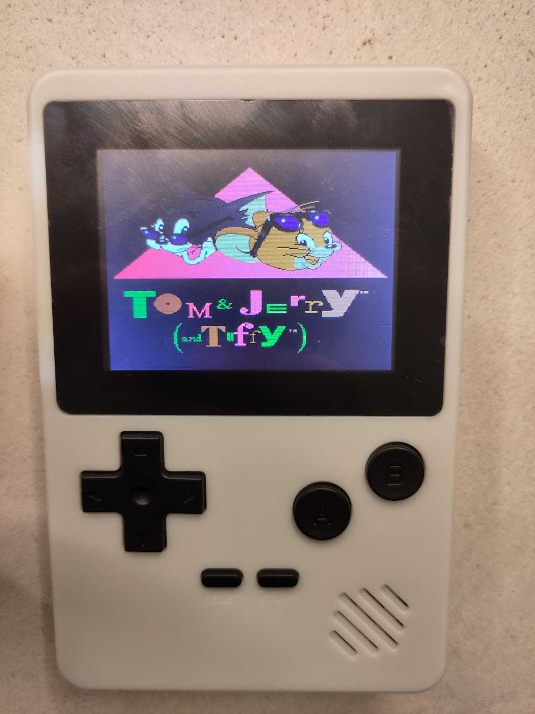

# VT-XX Rom builder

## What is this?
This is a program I used to modify the ROM of my cheap, chinese [game console](https://forums.nesdev.org/viewtopic.php?t=23807). It modifies the original ROM, and replaces its games with different NES games

## How do I use it?
If you do not have the exact same game console as I have, you are probably going to need to modify the program to fit your console. But if you do have the exact same console, using this should go along these lines:

1. Dump the flash chip of your game console. (Sorry I can't provide this, it contains copyrighted material)
2. Add a NES header to that dump: `0x4E, 0x45, 0x53, 0x1A, 0x00, 0x00, 0x00, 0x0B, 0xC1, 0x02, 0x07, 0x00, 0x00, 0x08, 0x00, 0x00`
3. Rename that file to "rom.nes" and place it in a folder named "dump" in this directory.
4. Create a folder named "output" next to your "dump" folder
5. Create a folder named "roms". In this folder, create 6 folders: (you can name these folders differently to change the category titles in your final ROM)
     - "0 - action"
     - "1 - fighting"
     - "2 - sport"
     - "3 - shoot"
     - "4 - racing"
     - "5 - puzzle"
6. Place NES Roms in these folders. Only mapper 0/1/3/4 games will work as far as I know.
7. Compile main.cpp with the command: `g++ -g ./*.cpp -o ./main`
8. Run the executable: `./main`
9. Try out the "output.nes" rom in NintendulatorNRS.
10. If you're satisfied, remove the NES header (first 16 bytes) from your "output.nes" and flash it back to your console's flash chip.
11. Enjoy plaing Tom & Jerry on your crappy game console!
